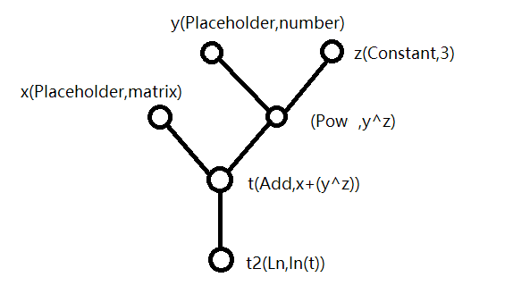

# 计算图API说明

## Tensor

Tensor是计算图中数据的形式，计算图中节点通过传递Tensor类型来传递数据，Tensor既可以是一个实数，也可以是一个矩阵，Tensor接口如下

|代码|解释|
|---|---|
|`Tensor t(val)`|创建一个Tensor表示实数，使用实数val初始化，不传递参数则默认为0|
|`Tensor t(n,m,mat)`|创建一个Tensor表示n\*m的矩阵，若传递指针mat，则使用实数矩阵mat初始化，否则为全0矩阵|
|`Tensor t(n,m,rand)`|传递一个`double ()`类型的随机数生成函数，使用该函数初始化矩阵中的数字|
|`t1=t2`|赋值运算符|
|`t1+t2` `t1+=t2` `t1-t2` `t1-=t2`|当t1与t2同类型(数字/矩阵，矩阵要求同规模)时可运算，否则抛出错误|
|`t1*t2`|当t1与t2同为矩阵，进行矩阵乘法；同为数字，进行乘法；类型不同，进行数字与矩阵的数乘，否则抛出错误|
|`t1*=t2`|首先要求两个Tensor可以进行乘法，其次要求结果与t1同类型(若为矩阵还要求同规模)，否则抛出错误|
|`t1/t2` `t1/=t2`|t2必须是表示值的Tensor，若t1为矩阵，表示对矩阵中所有值分别运算，若t1为值，则为除法，否则抛出错误|
|`t.N()` `t.M()`|若t表示矩阵，返回矩阵的大小，否则返回0|
|`t.Type()`|若t表示矩阵，返回true|
|`t.Value()`|若t表示值，返回t的值，否则报错|
|`t.Matrix()`|若t表示矩阵，返回矩阵的指针，否则报错|
|`t.PrintType`|返回一个字符串，形如`Matrix(1*2)`或`Number`|
|`t.Print(pre=6)`|返回t的值的string类型，若t表示矩阵，返回一个字符串，形如`|2.12\t|3.20\t|\n` ，否则形如`6.00`，pre可以设置打印精度，0~6表示小数点后的数字个数|
|`t.Quadratic_Cost()`|若t表示矩阵，返回二次代价函数$\frac{1}{nm}\sum a_{ij}$，double类型，否则报错|
|`exp(t)` `ln(t)` `sin(t)` `cos(t)` `tan(t)` `asin(t)` `acos(t)` `atan(t)` |若t表示矩阵，则对每个元素分别进行该运算，若t表示值，则为初等函数|
|`pow(t,d)`|d为double类型，若t为值，则对值求power函数，否则对矩阵中每个元素求值|
|`pow(t1,t2)`|t2必须表示值，运算同上，否则报错|


## Node

以下节点均继承自Node基类，均支持如下操作
|代码|解释|
|---|---|
|`nd.Debug()`|初始时nd为ndebug状态，将nd节点设置为debug状态，计算图运行时会打印该节点|
|`nd.NDebug()`|设置回ndebug状态|
|`nd.Name()`|返回nd节点的名字，Placeholder一定有名字，其他节点可选|
|`nd.PrintExpr()`|返回计算nd的中缀表达式，例如`ans=x+y*exp(z)`|
|`nd.Expr()`|裸中缀表达式，例如`x+y*exp(z)`|
|`nd.PrintRely()`|返回一个字符串，表示nd节点依赖的所有输入，例如ans节点依赖于x,y,z三个输入|
|`nd.Eval(map<string,Tensor>)`|使用map类型参数作为输入，计算nd的节点，返回一个Tensor，例如`ans.Eval(Inputs)`|
|`nd.Eval({{string,Tensor},...})`|使用初始化列表作为输入，计算nd节点，返回一个Tensor，例如，`ans.Eval({{"x",3},{"y",2},{"z",6}})`|


### Placeholder

输入节点，用来计算图的输入，Placeholder接口如下

|代码|解释|
|---|---|
|`Placeholder(name)`|建立一个表示值的命名为name的输入节点|
|`Placeholder(n,m,name)`|建立一个n\*m的矩阵类型输入|

###Constant

常数节点，Constant接口如下
|代码|解释|
|---|---|
|`Constant t(tensor,nm)`|创建一个常数节点，值为Tensor类型的tensor，名字是可选的，string类型|

###Variable

变量节点，可以修改值的Constant节点，接口如下

|代码|解释|
|---|---|
|`Variable v(tensor,nm)`|nm可选，生成一个初值为tensor的变量节点|
|`Variable v(nm)`|nm可选，生成一个初值为0的变量节点|
|`Variable v(n,m,nm)`|nm可选，生成一个初值为n\*m的零矩阵的变量节点|
|`v.Set(tensor)`|将v的值设为tensor|
|`v.Add(tensor)` `v.Sub(tensor)` `v.Mul(tensor)` `v.Div(tensor)` `v+=tensor` `v-=tensor` `v*=tensor` `v/=`|将v点的值做相应的操作|
### 二元运算节点
二元运算节点包括`Add` `Sub` `Mul` `Div` `Pow`，构造方式类似，以`Add`举例
|代码|解释|
|---|----|
|`Add t(a,b,name)`|name是可选的，建立一个依赖a,b的加法节点，只要a,b计算结果的Tensor可以进行该运算|
|`auto t=a+b`|相当于`Add t(a,b)`|


事实上，所有的二元运算可以混用(只要不涉及一元运算)，以便快速建立计算图，例如
```c++
auto t=a+b*c;//建立计算图 t=Add(a,tmp) tmp=Mul(b,c)
```

###一元运算节点

一元运算节点包括`Exp` `Ln` `Sin` `Cos` `Tan` `Asin` `Atan` `Acos` `Quadratic` `Sigmoid` `Transpose` `PowC`

前8种运算类似，以`Exp`举例，构造函数如下

```c++
Exp ans(nd,name);//name是string类型，是可选的
```

Quadratic是计算二次代价函数节点，Transpose是矩阵转置节点，只能连接到计算结果为矩阵的节点上，否则报错 

Sigmoid函数节点是用来计算神经网络中常见的Sigmoid函数($\frac{1}{1+e^{-z}}$)的节点，绑定到矩阵上表示对矩阵每个元素均进行该操作

PowC是二元运算Pow指数为常数的情况，构造函数如下

```c++
PowC ans(nd,2.0);//构造一个平方节点
PowC ans2(nd,0.5);//构造一个开方节点
```

### 运算图样例

以下是一段运算图代码样例

```c++
auto x = Placeholder(3, 3, "x");
auto y = Placeholder("y");
auto z = Constant(3, "z");
auto v = Variable(3, 3, "v"); 
auto t = x + (v ^ y);
double **M1 = new double* [3];
M1[0] = new double [3]{10, 0, 0};
M1[1] = new double [3]{0, 10, 0};
M1[2] = new double [3]{0, 0, 10};
Tensor a(3, 3, M1);
v.Set(a);
v.Add(a);
std::cout << t.Eval({{"x", a}, {"y", 2}}).Print();
auto t2 = Ln(t);
t.Debug();
std::cout << t2.Eval({{"x", a}, {"y", 2}}).Print();
std::cout << t2.PrintRely();
std::cout << t2.PrintExpr();
```

运行结果如下

```
|410.000000     0.000000        0.000000        |
|0.000000       410.000000      0.000000        |
|0.000000       0.000000        410.000000      |//节点t运算所得Tensor
Print Operator:(Matrix(3*3))=(x+(Variable(v)^y))
|410.000000     0.000000        0.000000        |
|0.000000       410.000000      0.000000        |
|0.000000       0.000000        410.000000      |//节点tDebug状态下输出的表达式以及值

|6.016157       -inf    -inf    |
|-inf   6.016157        -inf    |
|-inf   -inf    6.016157        |//节点t2运算所得Tensor
 rely on:
        x(Matrix3*3)
        y(Number)//节点t2所依赖的Placeholder
 = ln((x+(Variable(v)^y)))//节点t2的运算表达式
```

其对应的运算图为

