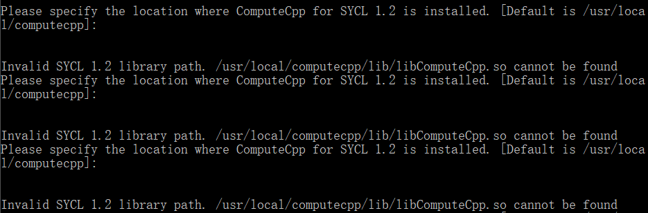
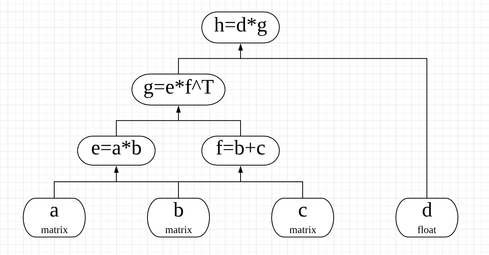

# 
面向对象程序设计试点项目报告

# 
计算图

## 对计算图的理解

计算图又叫数据流图，是一种通过有向图的形式表述计算过程的方法。计算图的节点分为常数节点、计算节点、特殊节点（输出、修改等）。节点之间的边表示数据的依赖关系。

- 常数节点主要作为计算图的输入，该节点是零入度节点，用于表示一个常数
- 计算节点表示一个计算过程，例如加法、乘法等，输入为计算的参数，输出是计算结果
- 特殊节点包括输出、修改等，用于完善功能

使用计算图可以结构化地表达计算过程，在机器学习领域有重要应用。

## 安装过程

- 按照<https://www.tensorflow.org/api_guides/cc/guide>的说明进行操作。平台为Windows下的Ubuntu子系统：

`Linux version 4.4.0-43-Microsoft (Microsoft@Microsoft.com) (gcc version 5.4.0 (GCC) ) #1-Microsoft Wed Dec 31 14:42:53 PST 2014`

- 在[GitHub仓库](https://github.com/tensorflow/tensorflow)中下载源码
- [安装Bazel](https://docs.bazel.build/versions/master/install-ubuntu.html#install-with-installer-ubuntu)（注：不要忘了把安装路径添加到PATH）
- 运行`./configure`进行配置，这里`Do you wish to build TensorFlow with OpenCL support? [y/N] n
`要选n，否则会出现如下一直循环的情况：

如果不幸出现这种情况，请`Ctrl+C`结束程序，重新配置，[参考这个链接](https://www.zybuluo.com/kakadee/note/657235)。
- 复制一份源码，建立文件`tensorflow/cc/example/example.cc`

写入如下内容：

	// tensorflow/cc/example/example.cc
	
	#include "tensorflow/cc/client/client_session.h"
	#include "tensorflow/cc/ops/standard_ops.h"
	#include "tensorflow/core/framework/tensor.h"
	
	int main() {
	  using namespace tensorflow;
	  using namespace tensorflow::ops;
	  Scope root = Scope::NewRootScope();
	  // Matrix A = [3 2; -1 0]
	  auto A = Const(root, { {3.f, 2.f}, {-1.f, 0.f} });
	  // Vector b = [3 5]
	  auto b = Const(root, { {3.f, 5.f} });
	  // v = Ab^T
	  auto v = MatMul(root.WithOpName("v"), A, b, MatMul::TransposeB(true));
	  std::vector<Tensor> outputs;
	  ClientSession session(root);
	  // Run and fetch v
	  TF_CHECK_OK(session.Run({v}, &outputs));
	  // Expect outputs[0] == [19; -3]
	  LOG(INFO) << outputs[0].matrix<float>();
	  return 0;
	}
- 建立文件`tensorflow/cc/example/BUILD`

写入如下内容：

	load("//tensorflow:tensorflow.bzl", "tf_cc_binary")
	
	tf_cc_binary(
	    name = "example",
	    srcs = ["example.cc"],
	    deps = [
	        "//tensorflow/cc:cc_ops",
	        "//tensorflow/cc:client_session",
	        "//tensorflow/core:tensorflow",
	    ],
	)

- 运行`bazel run -c opt //tensorflow/cc/example:example`，然后见证奇迹。首次编译时间较长，可以先去打一局排位（误）。如果输出是`19 -3`则运行正确。

## 类与接口介绍

以下对常用的类与接口进行简单介绍，具体内容可查阅[官方文档](https://www.tensorflow.org/api_guides/cc/guide)。

首先需要说明一些常用概念。在TensorFlow中，用**张量(tensor)**来表示数据，使用**图(graph)**来表示计算任务，图中的节点称为**op(operation)**。计算的过程是，在**会话(Session)**里启动一个图，会话将图的op分发到CPU（或GPU）中计算，然后返回`tensorflow::Tensor`实例。

### tensorflow::Scope
Scope类是维护计算图当前状态的主要数据结构，里面包含了计算图的一些属性，也封装了一些TensorFlow的操作。在构造节点时，Scope对象需要作为第一个参数传入。

	Scope root = Scope::NewRootScope();
	//生成一个新的scope

### Operation Constructors

TensorFlow中，不同的op类型由不同的类实现，我们可以通过Operation Constructors来构造节点。

#### 运算节点
	auto a = Add(scope, a, b);					//加法
	auto m1 = Multiply(scope, a, b);			//这里做的是对应元素相乘，注意和下面的矩阵乘法区分
	auto m2 = MatMul(scope, a, b);				//创建矩阵乘法节点，a, b为两个输入参数
	auto m3 = MatMul(scope, a, b, MatMul::TransposeA(true));
	//构造节点时可以指定一些属性，上面表示对第一个参数进行转置
	auto m = MatMul(scope, a, b, MatMul::TransposeA(true).TransposeB(true));
	//多个属性可以这样写，表示对两个参数都进行转置操作
#### 常数节点
	auto f = Const(scope, 3.14);					//创建浮点常量
	auto s = Const(scope, "Helloworld!");			//字符串常量
	auto t = Const(scope, {{{1},{2},{3}}});			//创建1×3×1的张量
	auto c1 = Const(scope, 10, /* shape */ {2, 2});	
	//也可以这样指定一个2×2的矩阵
	auto c2 = Const(scope, {1, 2, 3, 4, 5, 6}, /* shape */ {1, 3, 2, 1});
	//这样则是1×3×2×1的四阶张量，比大括号嵌套的写法可读性更强

### tensorflow::ClientSession
我们需要一个session来执行运算图。session可以对计算图进行封装。具体地，我们将使用ClientSession类来实现。主要接口如下：

	ClientSession(const Scope & scope);
	//构造函数，接收一个Scope对象

	Run(const std::vector<Output>& fetch_outputs, std::vector<Tensor>* outputs) const;
	//运行计算图，第一个参数为要计算的节点们，第二个参数为保存输出的地址

同样需要传入Scope作为参数。下面是一个例子：

	Scope root = Scope::NewRootScope();			//搞一个scope
	auto c = Const(root, { {1, 1} });			
	auto m = MatMul(root, c, { {42}, {1} });	//创建两个节点
	
	ClientSession session(root);				//创建session
	std::vector<Tensor> outputs;				//用它保存输出
	session.Run({m}, &outputs);
	// outputs[0] == {42}

## 构建运算图

利用上面介绍的接口，我们可以建立一个简单的运算图，如下。

abcd为四个输入节点，中间有若干计算节点，最后算出h的值。

## 优劣

通过图的形式描述计算有许多优点：

1. 通过计算图编写的程序不是逐步计算，而是先构建一个整体的图，然后通过一个session来处理，有利于整体优化，提高效率。
2. 便于求导。在神经网络的随机梯度下降求解方法中需要计算梯度，这个过程往往涉及上百万个参数，如果用传统的方法逐个求导将极其复杂，而基于运算图的反向传播算法(back propagation)可以大大提高计算效率。

当然缺点也是显而易见的，这种结构编程较为复杂，也给调试增加了难度。

## *求导功能

## *Variable

## *神经网络手写数字识别

## References

以下页面在完成作业时有参考，但未在文中显式列出，也没有加入超链接。

1. https://blog.csdn.net/jmh1996/article/details/73201060#t0
2. http://wiki.jikexueyuan.com/project/tensorflow-zh/get_started/basic_usage.html
3. https://blog.csdn.net/lenbow/article/details/52152766
4. https://blog.csdn.net/jmh1996/article/details/78091115
