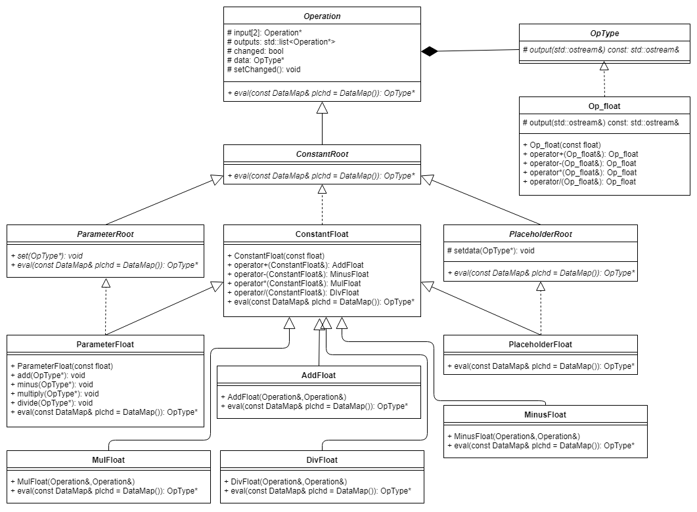

# 文档

## 编译环境

理论上只要支持c++11就可以。我们使用的编译器版本：
	
	g++ (Ubuntu 5.4.0-6ubuntu1~16.04.9) 5.4.0 20160609

在Linux下make即可。

## 框架设计

所有类和接口的定义均在命名空间`ops`中。类的结构如下图：

### Operation
Operation类是所有节点的抽象基类，PlaceholderRoot和ParameterRoot是placeholder和parameter的抽象基类。采取这种设计可以方便地将代码拓展到向量、矩阵等其他类型，而不是局限于float标量。在Operation类中，input表示输入节点（1或2个），outputs是输出节点，changed为标签，记录当前存储的data是否最新，data存放了数据。

### OpType
OpType类是所有类型的基类。为了实现类型可扩展，我们采取了这种策略。OpType派生出的Op_float类是对float的一个封装（自然也重载了+,-,*,/），这样可以通过OpType指针管理所有将来可能有的数据类型。

### eval
eval接口接收一个map参数：

	typedef std::map<ops::PlaceholderRoot*, ops::OpType*> DataMap;
通过map的形式给出placeholder的值。基类的eval函数为纯虚函数，提供了为placeholder赋值的公共代码。以AddFloat为例，此类的eval函数首先调用基类的公共代码，然后检查data是否是最新，如果是则返回data，否则调用输入节点的eval函数（此时无需再传入参数，直接调用eval()），并将changed改为true。

### 四则运算
目前非抽象类只有ConstantFloat类和他的派生类，在ConstantFloat中重载了加减乘除操作，加法返回AddFloat节点，其他同理。这样所有的节点都可以进行四则运算。

在AddFloat等节点当中，并没有立即计算，只是保存了两个输入节点的指针，只有当调用eval函数的时候才会计算并存入data。

## 接口详细说明

构造一个没有输入节点的节点：

    PlaceholderFloat x1;
	ConstantFloat x2(3);
	ParameterFloat x3(2);
构造一个运算节点：

	AddFloat y(x1,x2);		//y = x1 + x2
	auto y1 = x1 + x2;
	//上面两种方法等效，我们建议用第二种
	//其他运算类似
	auto y2 = x1 - x2;
	auto y3 = x1 * x2;
	auto y4 = x1 / x2;
修改Parameter的值：
	
	ParameterFloat z(10);
	z.add(2);				//z = 12
	z.minus(3);				//z = 9
	z.multiply(1);			//z = 9
	z.divide(3);			//z = 3
传入参数并运算：

	PlaceholderFloat a;
	PlaceholderFloat b;
	auto y = a + b;
	cout << y.eval({ {&a,pfloat(2)},{&b,pfloat(2.5)} });
也就是说，通过map的形式传入参数，map的每一项第一个是节点指针，第二个是OpType指针，在这里需要通过提供的pfloat函数把float转成op_float*。eval函数可以直接用cout输出。

print：
	b = print(a);
	cout << b.eval();
	
## 其他注意事项

请尽量不要出现

	a = (b + c)/d;
	print(b+c);
这种写法，应该用

	a1 = b+c;
	a = a1/d;
	print(a1);
来替代。因为第一种方式会出现右值，可能会带来一些问题。