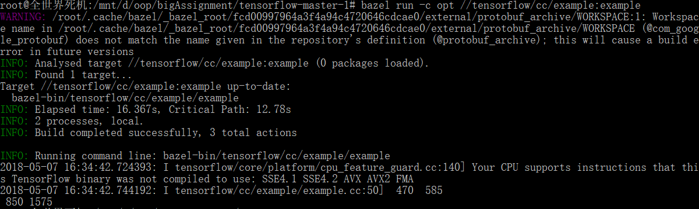

# 
面向对象程序设计试点项目报告

# 
计算图

## 对计算图的理解

计算图又叫数据流图，是一种通过有向图的形式表述计算过程的方法。计算图的节点分为常数节点、计算节点、特殊节点（输出、修改等）。节点之间的边表示数据的依赖关系。

- 常数节点主要作为计算图的输入，该节点是零入度节点，用于表示一个常数
- 计算节点表示一个计算过程，例如加法、乘法等，输入为计算的参数，输出是计算结果
- 特殊节点包括输出、修改等，用于完善功能

使用计算图的好处在于可以结构化地表达计算过程，并且便于进行操作，在机器学习领域有重要应用。Tensorflow是对计算图的一个很好的实现。通过图的形式描述计算有许多优点：

1. 通过计算图编写的程序不是逐步计算，而是先构建一个整体的图，然后通过一个session来处理，有利于整体优化，提高效率。
2. 便于求导。在神经网络的随机梯度下降求解方法中需要计算梯度，这个过程往往涉及上百万个参数，如果用传统的方法逐个求导将极其复杂，而基于运算图的反向传播算法(back propagation)可以大大提高计算效率。

当然缺点也是显而易见的，这种结构编程较为复杂，也给调试增加了难度。

## 安装过程

按照<https://www.tensorflow.org/api_guides/cc/guide>的说明进行操作。平台为Windows下的Ubuntu子系统：

`Linux version 4.4.0-43-Microsoft (Microsoft@Microsoft.com) (gcc version 5.4.0 (GCC) ) #1-Microsoft Wed Dec 31 14:42:53 PST 2014`

### 1.在[GitHub仓库](https://github.com/tensorflow/tensorflow)中下载源码
### 2.[安装Bazel](https://docs.bazel.build/versions/master/install-ubuntu.html#install-with-installer-ubuntu)
按照说明操作即可，不要忘了将Bazel安装目录添加到PATH：

	$ sudo vim /etc/profile 
在末尾加入
	
	export PATH="$PATH:$HOME/bin"
上面是默认安装位置，可根据实际情况修改。

### 3.配置
运行`./configure`进行配置，里面选项我也不知道干嘛的，就全用了默认值，结果出错了。查阅[资料](https://www.zybuluo.com/kakadee/note/657235)发现，其中有一步
	
	Do you wish to build TensorFlow with OpenCL support? [y/N]
要选`n`，否则会出现如下一直循环的情况：

如果不幸出现这种情况，请`Ctrl+C`结束程序，重新配置。

### 4.测试
复制一份源码，建立文件`tensorflow/cc/example/example.cc`，写入如下内容：

	// tensorflow/cc/example/example.cc
	
	#include "tensorflow/cc/client/client_session.h"
	#include "tensorflow/cc/ops/standard_ops.h"
	#include "tensorflow/core/framework/tensor.h"
	
	int main() {
	  using namespace tensorflow;
	  using namespace tensorflow::ops;
	  Scope root = Scope::NewRootScope();
	  // Matrix A = [3 2; -1 0]
	  auto A = Const(root, { {3.f, 2.f}, {-1.f, 0.f} });
	  // Vector b = [3 5]
	  auto b = Const(root, { {3.f, 5.f} });
	  // v = Ab^T
	  auto v = MatMul(root.WithOpName("v"), A, b, MatMul::TransposeB(true));
	  std::vector<Tensor> outputs;
	  ClientSession session(root);
	  // Run and fetch v
	  TF_CHECK_OK(session.Run({v}, &outputs));
	  // Expect outputs[0] == [19; -3]
	  LOG(INFO) << outputs[0].matrix<float>();
	  return 0;
	}
建立文件`tensorflow/cc/example/BUILD`，写入如下内容：

	load("//tensorflow:tensorflow.bzl", "tf_cc_binary")
	
	tf_cc_binary(
	    name = "example",
	    srcs = ["example.cc"],
	    deps = [
	        "//tensorflow/cc:cc_ops",
	        "//tensorflow/cc:client_session",
	        "//tensorflow/core:tensorflow",
	    ],
	)

运行`bazel run -c opt //tensorflow/cc/example:example`，然后见证奇迹即可。首次编译时间较长，可以先去打一局农药（误）。如果输出是`19 -3`则运行正确。

## 类与接口介绍

以下对常用的类与接口进行简单介绍，具体内容可查阅[官方文档](https://www.tensorflow.org/api_guides/cc/guide)。

首先需要说明一些常用概念。在TensorFlow中，用**张量(tensor)**来表示数据，使用**图(graph)**来表示计算任务，图中的节点称为**op(operation)**。计算的过程是，在**会话(Session)**里启动一个图，会话将图的op分发到CPU（或GPU）中计算，然后返回`tensorflow::Tensor`实例。

### tensorflow::Scope
Scope类是维护计算图当前状态的主要数据结构，里面包含了计算图的一些属性，也封装了一些TensorFlow的操作。在构造节点时，Scope对象需要作为第一个参数传入。

	Scope root = Scope::NewRootScope();
	//生成一个新的scope

### Operation Constructors

TensorFlow中，不同的op类型由不同的类实现，我们可以通过Operation Constructors来构造节点。所有的Operation Constructors第一个参数都为Scope对象，因此首先需要定义一个Scope。
	
	Scope scope = Scope::NewRootScope();

#### 运算节点
	auto a = Add(scope, a, b);					//加法
	auto m1 = Multiply(scope, a, b);			//这里做的是对应元素相乘，注意和下面的矩阵乘法区分
	auto m2 = MatMul(scope, a, b);				//创建矩阵乘法节点，a, b为两个输入参数
	auto m3 = MatMul(scope, a, b, MatMul::TransposeA(true));
	//构造节点时可以指定一些属性，上面表示对第一个参数进行转置
	auto m = MatMul(scope, a, b, MatMul::TransposeA(true).TransposeB(true));
	//多个属性可以这样写，表示对两个参数都进行转置操作
#### 常数节点
	auto f = Const(scope, 3.14);					//创建浮点常量
	auto s = Const(scope, "Helloworld!");			//字符串常量
	auto t = Const(scope, {{{1},{2},{3}}});			//创建1×3×1的张量
	auto c1 = Const(scope, 10, /* shape */ {2, 2});	
	//也可以这样指定一个2×2的矩阵
	auto c2 = Const(scope, {1, 2, 3, 4, 5, 6}, /* shape */ {1, 3, 2, 1});
	//这样则是1×3×2×1的四阶张量，比大括号嵌套的写法可读性更强
#### Placeholder
Placeholder允许我们在运行时输入节点的数值，而不必在构建运算图时指定数值，从而起到占位符的作用。

	auto a = Placeholder(scope, DT_INT32);

第二个参数表示数据类型，常用数据类型如下表，更多内容请查阅[官方API](https://www.tensorflow.org/versions/r1.0/programmers_guide/dims_types)：

|数据类型|描述|
|---|---|
|DT_INT32|32位整数|
|DT_FLOAT|32位浮点数|
|DT_DOUBLE|64位浮点数|
|DT_COMPLEX64|两个float组成的复数|
|DT_STRING|字符串|

### tensorflow::ClientSession
我们需要一个session来执行运算图。session可以对计算图进行封装。具体地，我们将使用ClientSession类来实现。主要接口如下：

	ClientSession(const Scope & scope);
	//构造函数，接收一个Scope对象

	Run(const std::vector<Output>& fetch_outputs, std::vector<Tensor>* outputs) const;
	//运行计算图，第一个参数为要计算的节点们，第二个参数为保存输出的地址

	Run(
	  const FeedType & inputs,						//以map形式输入参数
	  const std::vector< Output > & fetch_outputs,	//要计算的节点
	  std::vector< Tensor > *outputs				//输出
	) const;

下面是一个例子：

	Scope root = Scope::NewRootScope();			//搞一个scope
	auto c = Const(root, { {1, 1} });			
	auto m = MatMul(root, c, { {42}, {1} });	//创建两个节点
	
	ClientSession session(root);				//创建session
	std::vector<Tensor> outputs;				//用它保存输出
	session.Run({m}, &outputs);
	// outputs[0] == {42}

## 构建运算图

利用上面介绍的接口，我们可以建立一个简单的运算图，如下。

abcd为四个输入节点，中间有若干计算节点，最后算出h的值。重写example的代码：

	#include "tensorflow/cc/client/client_session.h"
	#include "tensorflow/cc/ops/standard_ops.h"
	#include "tensorflow/core/framework/tensor.h"
	
	int main(){
	    using namespace tensorflow;
	    using namespace tensorflow::ops;
	    Scope root = Scope::NewRootScope();
	
	    /* 构建运算图 */
	    auto a = Placeholder(root, DT_INT32);
	    auto b = Placeholder(root, DT_INT32);
	    auto c = Const(root, { {3, 1}, {2, 2} });
	    auto d = Placeholder(root, DT_INT32);
	
	    auto e = MatMul(root, a, b);
	    auto f = Add(root, b, c);
	    auto g = MatMul(root, e, f, MatMul::TransposeB(true));
	    auto h = Multiply(root, d, g);      //注意这里的乘法是元素直接乘
	
	    /* 执行计算 */
	    std::vector<Tensor> outputs;
	    ClientSession session(root);
	    session.Run(
	        { {a, { {2, 1}, {0, 5} }}, {b, { {3, 3}, {7, -2} }}, {d, { {5, 5}, {5, 5} }} },
	        //全是大括号……眼花
	        {h},
	        &outputs);
	    LOG(INFO) << outputs[0].matrix<int>();
	
	    return 0;
	}

再次运行`bazel run -c opt //tensorflow/cc/example:example`，可以看到输出如下：

输出和预期一致，大成功！

## 设计的优劣

我们不打算从分布式性能、GPU内存占用等比较高级的应用层面进行评价，下面仅从面向对象程序设计课程的角度简单地探讨一下接口的优劣。

通过上面几个小例子可以看出，每一种运算节点都是单独的一个类，这样便于对不同的节点编写具体的实现函数。其优点就是面向对象编程的优点，用户只需调用提供的接口，不必关心内部实现（实际上我找了半天，想看看节点类的继承结构，但没找到）。例如在创建节点的时候，写法很统一：

	auto <变量名> = <节点名>(<Scope对象>, <其他参数>);

不管是计算节点还是常数节点，或者是Placeholder，定义方式都是统一的，便于编程。

通过`ClientSession`类把图的构造和执行分开，便于分开编程和调试，这也体现了面向对象编程的特点。

说到缺点，主要是难以上手。其他的缺点暂时也想不到什么，毕竟是Google的大佬们研发出来，并且修改了这么多版的。没有研究底层实现，也用的比较少，很难找出什么明显缺点。

## *求导功能

## *Variable

## *神经网络手写数字识别

简要介绍一下神经网络手写数字识别的原理。
### Sigmoid neurons

Sigmoid neurons就像神经元，有若干输入（即一个向量）和一个输出。输入一个向量，通过一个函数计算出输出)。在手写数字识别中，我们可以采用这样的函数：

其中

是仿射变换，

可以将输出光滑化，便于后面进行随机梯度下降寻找最优解。

### 构建神经网络

用许多个这种神经元，我们可以构造出一个多层神经网络，如下图。

(图片来源：http://neuralnetworksanddeeplearning.com/chap1.html，仅用作学习使用)

其中最左侧第一层的输入是待识别图片每一个像素的灰度值，中间有15个神经元，具体参数待定，10个输出表示该图片与某个数字的相似程度。

### 随机梯度下降

下一步就是计算神经元的参数，这里采用随机梯度下降法。首先我们需要有一组训练数据，对于数据集中的每一个输入

，我们都知道它的期望输出

。先随机取一组初始参数，计算出

对应的输出

，然后计算误差函数：

=\frac{1}{n}\sum_{i=1}^n|y_i-x_i|^2)

误差函数的自变量是神经元的参数，我们只要计算出梯度，然后让参数沿着梯度方向小幅度调整，就可以逐渐使误差趋向最低点，也就找到了最优解。

实际的神经网络中往往需要大量的神经元，因此参数个数巨大，计算梯度较为复杂，如果采用基于计算图的反向传播算法，则可以方便地进行梯度计算。

## References

以下页面在完成作业时有参考，但未在文中显式列出或加入超链接，在此一并表示感谢。

1. [Tensorflow C++学习(二)](https://blog.csdn.net/jmh1996/article/details/73201060#t0)
3. [Tensorflow一些常用基本概念与函数（1）](https://blog.csdn.net/lenbow/article/details/52152766)
4. [为什么Tensorflow需要使用"图计算"来表示计算过程](https://blog.csdn.net/jmh1996/article/details/78091115)
5. [Feeding a value for placeholder tensor in Tensorflow C++ API](https://github.com/tensorflow/serving/issues/518)
6. [Tensorflow源码 目录树](https://blog.csdn.net/JNingWei/article/details/73550444)