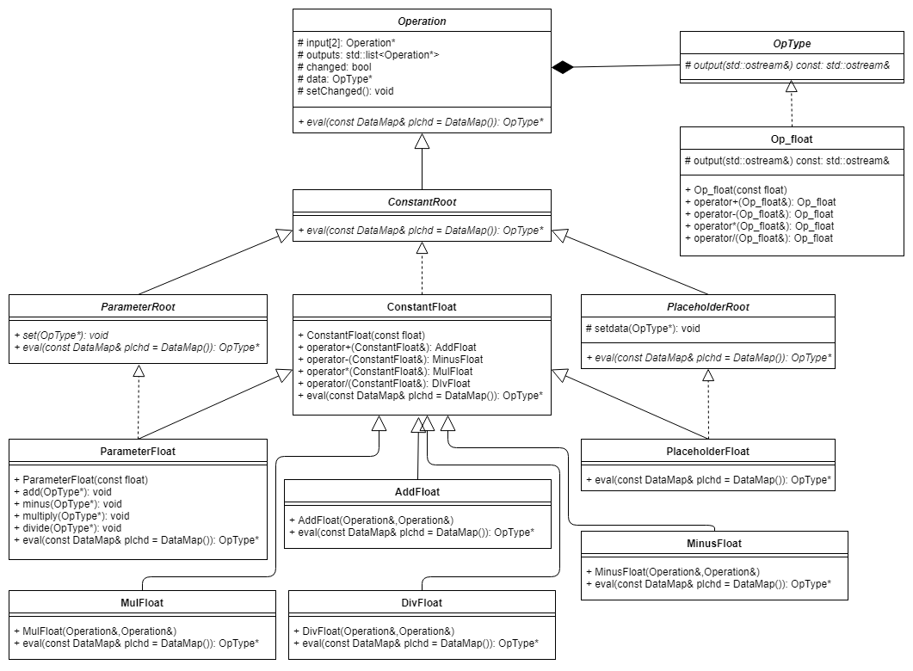

# 实验报告

## 框架设计

所有类和接口的定义均在命名空间`ops`中。类的结构如下图：

### Operation
Operation类是所有节点的抽象基类，PlaceholderRoot和ParameterRoot是placeholder和parameter的抽象基类。采取这种设计可以方便地将代码拓展到向量、矩阵等其他类型，而不是局限于float标量。在Operation类中，input表示输入节点（1或2个），outputs是输出节点，changed为标签，记录当前存储的data是否最新，data存放了数据。

### OpType
OpType类是所有类型的基类。为了实现类型可扩展，我们采取了这种策略。OpType派生出的Op_float类是对float的一个封装（自然也重载了+,-,*,/），这样可以通过OpType指针管理所有将来可能有的数据类型。

### eval
eval接口接收一个map参数：

	typedef std::map<ops::PlaceholderRoot*, ops::OpType*> DataMap;
通过map的形式给出placeholder的值。基类的eval函数为纯虚函数，提供了为placeholder赋值的公共代码。以AddFloat为例，此类的eval函数首先调用基类的公共代码，然后检查data是否是最新，如果是则返回data，否则调用输入节点的eval函数（此时无需再传入参数，直接调用eval()），并将changed改为true。

### 四则运算
目前非抽象类只有ConstantFloat类和他的派生类，在ConstantFloat中重载了加减乘除操作，加法返回AddFloat节点，其他同理。这样所有的节点都可以进行四则运算。

在AddFloat等节点当中，并没有立即计算，只是保存了两个输入节点的指针，只有当调用eval函数的时候才会计算并存入data。

## 完成情况

第一阶段需求均已实现，示例代码如下：

### 1

	#include <iostream>
	#include <map>
	#include "Operation.h"
	#include "Optype.h"
	
	using namespace std;
	using namespace ops;
	
	//测试的时候请将文件名改为main.cpp, 或自行修改Makefile
	
	int main() {

	    auto x = PlaceholderFloat();
	    auto y = PlaceholderFloat();
	    auto z = ConstantFloat(3);
	    auto t1 = x+y;
	    auto t2 = y/z;
	    auto res = t1*t2;
	    cout << res.eval({ {&x, pfloat(1)} , {&y, pfloat(2)} }) << endl; //2
	    cout << res.eval({ {&x, pfloat(3)} , {&y, pfloat(1)} }) << endl; //1.333333
	    cout << res.eval({ {&x, pfloat(4)} , {&y, pfloat(5)} }) << endl; //15
	
	    return 0;
	}

### 2
    auto x = PlaceholderFloat();
    auto y = PlaceholderFloat();
    auto z = x*y;
    auto zp = Print(z);
    auto res = y-zp;
    cout << res.eval({ {&x, pfloat(4)} , {&y, pfloat(2.5)} }) << endl; 
    cout << res.eval({ {&x, pfloat(3)} , {&y, pfloat(7)} }) << endl; 
### 3 
    auto x = PlaceholderFloat();
    auto y = PlaceholderFloat();
    auto z = x*y;
    auto zp = Print(z);
    auto t1 = y-zp;
    auto t2 = zp/t1;
    auto t3 = zp+t2;
    cout << t3.eval({ {&x, pfloat(2)} , {&y, pfloat(4)} }) << endl; 
### 4
    auto x = PlaceholderFloat();
    auto y = ParameterFloat();
    auto z = ParameterFloat(2);
    y.set(2.3);
    y.multiply(3);
    cout << y.eval() << endl;    //6.9
    auto t = y/z;
    z.add(1);
    z.minus(1.5);
    z.divide(-2);
    auto res = t*x;
    cout << res.eval({ {&x, pfloat(2)} }) << endl;  //-18.4
### 5
第五段代码演示删除节点

    //节点支持删除操作
    auto x = new PlaceholderFloat();
    auto y = new ConstantFloat(1.5);
    auto z = new AddFloat(*x, *y);
    cout << z->eval({ {x, pfloat(2)} }) << endl;  //3.5

    //delete y;  //会输出Error:还有以这个节点为输入的节点

    delete z;
    delete y;   //必须先删除z再删y